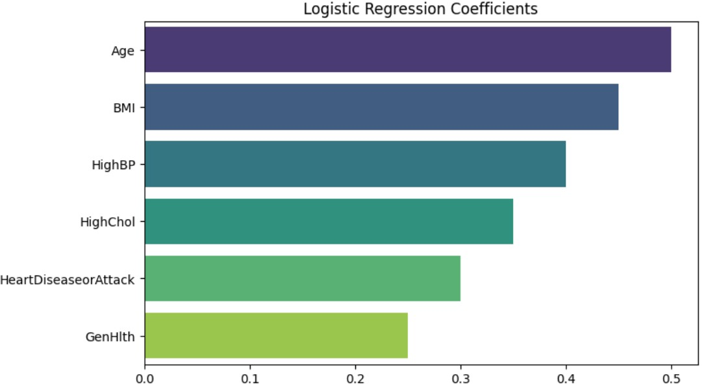

  
  
  
  

## 프로젝트 주제 : 머신러닝 기반 당뇨병 진단 예측 모델
- 당뇨병 진단 여부와 관련된 다양한 위험 요인들을 탐색하고, 
각 요인들이 당뇨병 발생과 어떤 통계적 관련성을 가지는지 검증

## 1. Project Overview 
- **주제** : 생활 습관 및 건강 지표를 활용한 당뇨병 유무 분류
- **프로젝트 기간** : 2025/12/29 ~ 2025/12/30
- **데이터셋** : [Diabetes Health Indicators Dataset](https://www.kaggle.com/datasets/mohankrishnathalla/diabetes-health-indicators-dataset/data)
- **핵심 목표** : 
    1. 당뇨병과 관련된 주요 위험 요인을 통계적으로 검증
    2. 머신러닝 기반 예측 모델을 통해 고위험군 선별 가능성 평가

## 2. Data Dictionary (주요 핵심 변수)
- 관측치 수 : 약 25만 건
- 변수 개수 : 총 31개
- 타겟 변수 : Diabetes_binary

| 변수명 | 설명 | 값의 의미 |
| :--- | :--- | :--- |
| **Diabetes_binary** | 당뇨 여부 (**Target**) | 0: 음성, 1: 당뇨/전단계 |
| HighBP | 고혈압 여부 | 0: 정상, 1: 고혈압 |
| HighChol | 고콜레스테롤 여부 | 0: 정상, 1: 높음 |
| BMI | 체질량 지수 | 수치형 |
| Smoker | 흡연 여부 | 100개비 이상 흡연 여부 (0/1) |
| Stroke | 뇌졸중 경험 | 0: 없음, 1: 있음 |
| HeartDiseaseorAttack | 심장질환/심근경색 | 0: 없음, 1: 있음 |
| PhysActivity | 신체 활동 | 최근 30일 이내 운동 여부 (0/1) |
| GenHlth | 주관적 건강 상태 | 1(매우 좋음) ~ 5(매우 나쁨) |
| Age | 연령대 | 1(18-24) ~ 13(80세 이상) |
| Income | 소득 수준 | 1(최저) ~ 8(최고) |

## 3. Problem Definition
- **데이터 특성** : 
    + 대규모 설문 데이터로 이진형 변수 비중이 높음
    + Diabetes_binary 기준 클래스 불균형 존재 (비당뇨 다수)
    + 의료 수치(혈당 등) 없이 행동·생활 습관 변수 중심
- **분석 방향**
    + 통계분석 : 다중회귀, 분산분석, 로지스틱회귀
    + 머신러닝 : 로지스틱회귀, 결정트리, XGBoost, LightGBM 

## 4. Data Preprocessing
- **클래스 불균형 해소** : 타겟 변수 비율 불균형으로 인해
→ Stratified Sampling + Class Weight 조정 적용
- **범주형 변수 처리**
    + 순서형 : Age, GenHlth, Income
→ Ordinal Encoding 적용
    + 이진 변수 : 0 / 1 유지
- **데이터 스케일링** : Logistic Regression 등 선형 모델 적용을 위해
→ StandardScaler(표준화) 적용

## 5. 통계분석 핵심 인사이트
- 로지스틱 회귀 결과
    + 당뇨병 발생과 통계적으로 유의미한 양(+)의 관계를 보인 변수:
        - Age
        - BMI
        - HighBP
        - HighChol
        - HeartDiseaseorAttack
        - GenHlth

특히, **연령(Age)**과 BMI는 다른 변수들을 통제한 상태에서도 가장 강력한 설명력을 보임
주관적 건강 상태(GenHlth)가 나쁠수록 당뇨병 확률 증가

## 6. 모델링 평가지표
- 최종 선택 모델: XGBoost
- 선정 이유:
    + 가장 높은 Recall 및 F1-score
    + AUC-ROC 기준에서도 안정적인 분류 성능
    + 당뇨병 조기 선별이라는 프로젝트 목적에 부합

| Model               | AUC-ROC   | Accuracy  | Precision | Recall    | F1-Score  |
| ------------------- | --------- | --------- | --------- | --------- | --------- |
| Logistic Regression | 0.693     | 0.626     | 0.754     | 0.593     | 0.664     |
| Decision Tree       | 0.694     | 0.630     | 0.752     | 0.606     | 0.672     |
| **XGBoost**         | **0.721** | **0.681** | 0.703     | **0.845** | **0.768** |
| LightGBM            | 0.725     | 0.654     | **0.773** | 0.630     | 0.694     |

> **Note** : 최종 대회 결과는 Public 0.70504 / Private 0.70504 (feat. 1등 점수). 

## 7. Feature Importance (SHAP 기반)
- XGBoost + SHAP 분석 결과
- 당뇨병 예측에 가장 영향력이 큰 변수
    + Age
    + BMI
    + GenHlth
    + HighBP
    + HighChol
    → 생활 습관 및 만성질환 관련 변수가 복합적으로 작용함을 시사

## 8. Conclusion
- 설문 기반 건강 데이터만으로도 당뇨병 위험 예측이 가능함을 확인
- 연령, BMI, 고혈압·고지혈증 등 기존 의학적 위험 요인이
통계분석과 머신러닝 모두에서 일관되게 중요하게 나타남
- 본 모델은 의료 접근성이 낮은 환경에서 사전 선별 도구로 활용 가능성 존재

# 보고서
- 프로젝트 상세 보고서는 PDF 슬라이드 자료를 참고하여 주세요
-  보고서 : [머신러닝 기반 당뇨병 진단 예측 모델](report/프로젝트보고서.pdf)
- 분석코드 : [분석코드](분석코드.ipynb)

